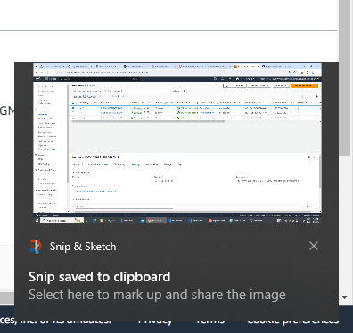
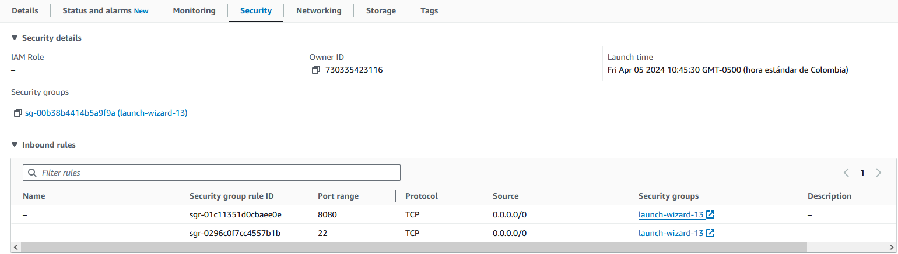
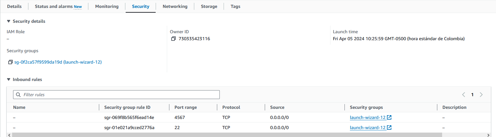

# Parcial2_AREP

## Demostración funcionamiento

https://github.com/MiguelBarreraD/Parcial2_AREP/assets/80360472/5de04878-2694-4a24-846e-e61d5be5b05e

## Arquitectura

La arquitectura de este sistema que consta de un servicio de cálculo de funciones de ordenamiento (Math Services) desplegado en múltiples instancias de EC2, y un servidor proxy que recibe las solicitudes de los clientes y las distribuye a las instancias de Math Services utilizando un algoritmo de round-robin. El proxy, también desplegado en una instancia de EC2, permite la configuración de las direcciones y puertos de los servicios de ordenamiento a través de variables de entorno. Los clientes web interactúan con el sistema de manera asíncrona, enviando sus solicitudes al proxy, que se encarga de delegar el procesamiento a las instancias apropiadas de Math Services y devolver los resultados al cliente.

    +-------------+     +---------------+     +-------------+
    |   Cliente   |     |    Proxy      |     | Math Service |
    |   Web       |---->|   Server      |---->|     #1       |
    +-------------+     +---------------+     +-------------+
                            |                 +-------------+
                            |                 | Math Service |
                            |-----------------|     #2       |
                                              +-------------+

## Instrucciones de uso

> [!IMPORTANT]
> El proyecto está diseñado para funcionar con la arquitectura de AWS descrita anteriormente. Es importante asegurarse de que esta arquitectura esté implementada y en funcionamiento correctamente para que el proyecto pueda operar según lo previsto.

Clonamos el repositorio del proyecto:

    $ git clone https://github.com/MiguelBarreraD/Parcial2_AREP.git
    $ cd Parcial2_AREP/
    $ mvn clean install

Ejecutamos los servicios:

1. Para las dos instancias de MathServices debemos ejecutar el siguiente comando:
    
        $ mvn exec:java -Dexec.mainClass=org.example.MathServices

2. Para el servidor Proxy ejecutamos el siguiente:
    
        $ mvn exec:java -Dexec.mainClass=org.example.proxyServer

3. Para ingresar a la aplicación, se debe utilizar la siguiente información:

        - Public IPv4 DNS: ec2-34-229-190-45.compute-1.amazonaws.com/
        - Puerto: 8080
        - URL completa: http://ec2-34-229-190-45.compute-1.amazonaws.com:8080/

## Construcción

### Creación maquinas:

Creamos 3 masquinas virtuales EC2:

Debemos configurar los grupos de seguridad para que nos permita realizar las peticiones a los servidores

Configuración para servidor proxy:
        Debemos abrir el pueto 8080 y permitir que se ingrese desde cualquier origen

Configuración para servidores MathServices:
        Debemos abrir el pueto 4567 y permitir que se ingrese desde cualquier origen

### Instalación de herramientas 

Instalación Git y JDK Java 17

    $ sudo yum install -y git
    $ sudo yum install -y java-17-amazon-corretto-devel 

Ejecutamos los siguientes comandos para instalar Apache Maven:

    $ sudo wget https://repos.fedorapeople.org/repos/dchen/apache-maven/epel-apache-maven.repo -O /etc/yum.repos.d/epel-apache-maven.repo
    $ sudo sed -i s/\$releasever/6/g /etc/yum.repos.d/epel-apache-maven.repo
    $ sudo yum install -y apache-maven

## Diseño

1. **ProxyServer:** Esta clase es el punto de entrada de la aplicación del servidor proxy.
        Configura el servidor Spark para escuchar en un puerto específico y define los endpoints para las operaciones de búsqueda lineal y binaria.
        Implementa la lógica del algoritmo de round-robin para delegar las solicitudes a las dos instancias del servicio MathService.
        Utiliza la clase HttpConnectionExample para hacer las solicitudes GET a los servicios MathService.
        Devuelve la respuesta recibida de los servicios MathService al cliente.
2. **MathServices:**
        Esta clase representa los servicios de búsqueda lineal y binaria.
        Configura el servidor Spark para escuchar en un puerto específico y define los endpoints para las operaciones de búsqueda lineal y binaria.
        Implementa la lógica de la búsqueda lineal y binaria utilizando las funciones de la clase Calculator.
        Construye y devuelve una respuesta JSON con los resultados de las operaciones de búsqueda.
3. **HttpConnectionExample:**
        Esta clase proporciona un método estático main() que realiza una solicitud HTTP GET a una URL dada.
        Configura la conexión HTTP, envía la solicitud y maneja la respuesta.
        Devuelve el cuerpo de la respuesta como una cadena.
        Esta clase se utiliza en el ProxyServer para delegar las solicitudes a los servicios MathService.
4. **Calculator:**
        Esta clase contiene las implementaciones de los algoritmos de búsqueda lineal y binaria.
        El método LinealSearch() realiza una búsqueda lineal en un arreglo de cadenas y devuelve la posición del elemento encontrado o -1 si no se encuentra.
        El método BinarySearch() realiza una búsqueda binaria en un arreglo de enteros y devuelve la posición del elemento encontrado o -1 si no se encuentra.
        Estos métodos se utilizan en la clase MathServices para implementar las operaciones de búsqueda.

## Autor

* Miguel Angel Barrera Diaz 
